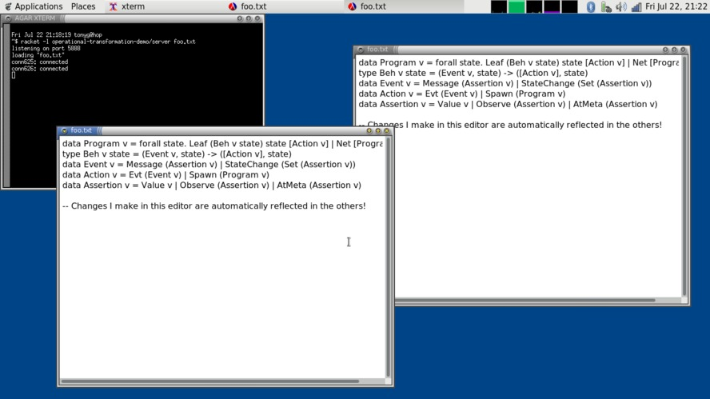

# Racket Operational Transformation

Implements
[Operational Transformation](https://en.wikipedia.org/wiki/Operational_transformation)
(OT) for Racket.

Inspired by the simplicity and elegance of the presentation in
[this blog post](http://blog.haskell-exists.com/yuras/posts/realtime-collaborative-editor.html).

# Installation

## From the package catalog

Run

    raco pkg install operational-transformation

Or, if you only want the library and not the demos,

    raco pkg install operational-transformation-lib

## From a git checkout

Check out the repository. Then, in the directory containing
`Makefile`,

    make link

# Running the demo

Find a text file you wish to collaboratively edit. Let's call it
`foo.txt`.

*Make sure you don't mind if `foo.txt` is saved to disk!* Each time a
change is made by a connected client, the demo server saves over the
file.

## Start the server

Change to the directory containing `foo.txt` and run

    racket -l operational-transformation-demo/server foo.txt

This will start a TCP server on localhost, port 5888 by default.
Supply `-p <portnumber>` before `foo.txt` on the command-line to
select a different port.

## Start the clients

Then, run multiple clients. Start each client with

    racket -l operational-transformation-demo/client localhost

Again, supply `-p <portnumber>` before `localhost` to select a
different server port.

# Licence

Copyright (C) 2016 Tony Garnock-Jones <mailto:tonyg@leastfixedpoint.com>

This program is free software: you can redistribute it and/or modify
it under the terms of the GNU Lesser General Public License as
published by the Free Software Foundation, either version 3 of the
License, or (at your option) any later version.

This program is distributed in the hope that it will be useful, but
WITHOUT ANY WARRANTY; without even the implied warranty of
MERCHANTABILITY or FITNESS FOR A PARTICULAR PURPOSE. See the GNU
Lesser General Public License for more details.

You should have received a copy of the GNU Lesser General Public
License along with this program (see the files "lgpl.txt" and
"gpl.txt"). If not, see <http://www.gnu.org/licenses/>.
